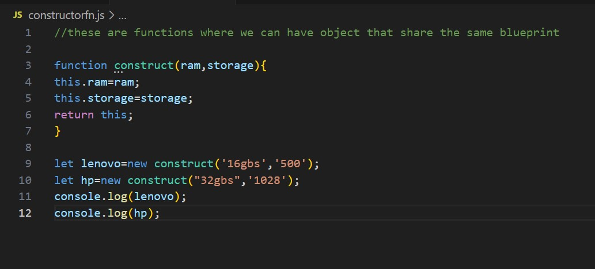

### 1. Javascript basic

Hello!. I hope you will enjoy learning with me the basics of javascript as it is the root to the senior website designer, app developer,etc

### 2. The basics include:
   -Printing hello world in javascript
   -Arithmetic operations
   -Ternary and template literal
   -functions
   -Objects
   -Arrays , etc,.

 ### 3. Extensions we need:

- To install **node.js**
<https://nodejs.org/en/download>

- ***Javascript*** from vs code extensions

### 4. Sample codes 



```let x=3
let result
result= (x%2===0)?"Even":"Odd"
console.log(result)
```
🙋‍♀️
